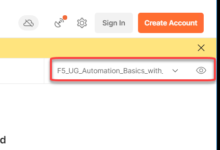
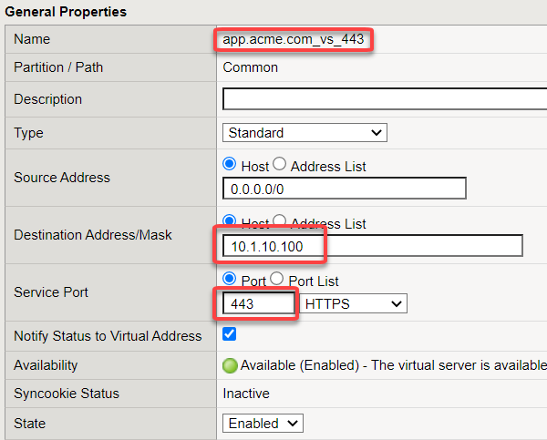

Lab 1 - Imperative Automation with iControl
===========================================

Objectives
----------

The intention of this lab will be to show how to work with imperative API calls.

Setup Lab Environment
-----------------------------------

To access your dedicated student lab environment, you will need a web browser and Remote Desktop Protocol (RDP) client software. The web browser will be used to access the Unified Demo Framework (UDF) Training Portal. The RDP client will be used to connect to the jumphost, where you will be able to access the BIG-IP management interfaces (HTTPS, SSH).

#. Click DEPLOYMENT located on the top left corner to display the environment

#. Click ACCESS next to jumphost.f5lab.local

    |accessjh|

#. Select your RDP resolution.

#. The RDP client on your local host establishes a RDP connection to the Jump Host.

#. Login with the following credentials:

    +------------+--------------+
    | User:      | f5lab\\user1 |
    +------------+--------------+
    | Password:  | user1        |
    +------------+--------------+

#. After successful logon you can launch the Chrome browser and use the bookmark "bigip1" to launch the WebUI to the BIG-IP.

    |chrome|
    |bookmark|

#. Login in to the BIG-IP with the following credentials:

    +------------+--------------+
    | Username:  | admin        |
    +------------+--------------+
    | Password:  | admin        |
    +------------+--------------+

..Note::  You can take a look around at the BIG-IP.  At this time we do not have any application configuration.

Task 0: Postman
----------------------------
For this lab we are going to use a tool called Postman.  This is a tool that can be used to send API calls.  We use it to craft and submit calls to the REST API of the BIG-IP.  `Postman Products <https://www.postman.com/products/>`__

#. Locate the icon on the Desktop for Postman

    |postman|

#. Double click on the icon and click "Yes" you want to allow this app to make changes.

#. A collection has been loaded along with an environment file:

    +-----------------+-----------------+
    |  |collection|   |  |environment|  |
    +-----------------+-----------------+

#. Click on the carrot next to expand the collection and expand **Lab 1 - Imperative Automation with iControl**

    |expand|

Task 1.1: Create
-----------------------------
For this task we will run an API call to our BIG-IP, examine that the call was processed and then run the rest of the commands to create a full configuration for our application app.acme.com.

#. Expand **1.1 Create** and click on **1.1.1 Create - LTM Node**.  Under the POST locate the **Body** and click on it.

    |task1_1|

#. From the Postman tool we are going to send a POST command to the BIG-IP REST API.  In our lab we are leveraging an Environment file to warehouse some variables. Click on the **eye** icon at the top right corner near the **environment file** name. We can see the {{big-ip}} equals the FQDN of our BIG-IP.

    |view_enviro|

    |bigip_var|

    .. Note:: You will also see that we are storing user and password.  These are the credentials used to login to the BIG-IP.  For this lab we are using Basic Auth which allows us to send the username and password with each POST, GET or PATCH.  This may not work in your own environment and we do have other ways to generate token authorization but that is an advanced skill we will cover in a later class.

#. Each POST, GET, or PATCH is sent to the BIG-IP (FQDN or IP Address) and then //mgmt//tm// to identify the namespace for traffic management.  Next we must identify the **organizing collection** which is equivalent to the modules in tmsh.  In our case we are just dealing with the LTM module.  Last we want to direct this POST to Node a collection within the LTM module.

    |post|

#. Now let's examine the JSON body where we plug in our configuration information for the collection we have identified. The body is in JSON format so we can identify the entity we want to configure.  In this case we have directed our call to **Node** and the two must have pieces of information to configure for a **Node** are the **name** and **dddress**.

    |json_node|

#. Return to the Chrome browser and access your BIG-IP.  Navigate to **Local Traffic --> Nodes --> Nodes List**.  We should not have any nodes configured at this time.

#. Go back to your Postman tool. You should still have the **POST** up to create our first **Node** on BIG-IP.  Click on **Send**

    |create_node|

#. At the bottom of the Postman screen you will see the response from the BIG-IP.  We want to see a **200 OK** response to know that the BIG-IP accepted our call and processed our request.  Looking at the return boy we can see that our name and address were transmitted.

    |200_OK_node|

#. Return to Chrome and the BIG-IP.  Navigate back to **Local Traffic --> Nodes --> Nodes List**

    ..Note:: If you are still on the screen click on **Nodes --> Nodes List** one more time to refresh the screen and make the newly created node visible.

    |node1|

#. Return to Postman and locate **1.1.2 Create - LTM Monitor**.  Click on it verify you see **https://{{big-ip}}/mgmt/tm/ltm/monitor/http** as the **POST**.  Check the **Body** to see the configuration and click **Send**. Verify **200 OK**.

    |http_monitor|

#. Repeat for steps **1.1.3 to 1.1.9**

    |repeat|

#. Return to Chrome and the BIG-IP.  Navigate to **Local Traffic --> Virtual Servers --> Virtual Server List**.  You should now see two new Virtual Servers for **app.acme.com** on port 443 and 80.

#. Click on **app.acme.com_vs_80**.  Note that it has an IP Address.  Click on the **Resources** tab at the top. Note that the **_sys_https_redirect** iRule has been attached.

#. Navigate back to **Local Traffic --> Virtual Servers --> Virtual Server List** and click on **app.acme.com_vs_443**

#. Note that we have the same IP Address assigned.  Scroll down and see that we have an **acme_https** HTTP profile attached and a client SSL profile called **app.acme.com_client-ssl**.  Continue scrolling and find that we have Source Address Translation set to **Automap**.

    |vs_app|
    |attach_profile|
    |automap|

#. Click **Resources** at the top.  See a pool has been set and a persistence profile.

    |resources|

#. Navigate to **Local Traffic --> Pools --> Pool List**.  Click on **app.acme.com_pool**.  Notice that the **app.acme.com_monitor** is attached.

    |app_pool|

#. Click on **Members**.  Notice that the node created at the beginning has been added to the pool.

    |member|

    .. Note:: Examine the order that we created the objects.  In imperative automation we have to know the exact order to create objects.  If we tried to create a pool but didn't have any pool members we would have an empty pool and have to **PATCH** the pool to add the a member.  If we tried to create a Virtual Server and attempted to attach a profile without creating the automation would fail.

#. Last step is to test that our Virtual Server works.  In Chrome you can go to https://app.acme.com or click on the **app.acme.com** bookmark.

    |app_acme_com|

Task 1.2: Read
-----------------------------
In this section we are going to use the API to discover information about our configuration using **GET**

#. From **Postman** expand **1.2 - Read**.  Locate **1.2.1 List - LTM Virtual Servers** and click on it.  Let's examine the request in the right pane.

    |1_2_read|

#. You will notice that this is not a **POST** but a **GET**.  We are still talking tot he BIG-IP on the LTM module and requesting information on Virtual.  Click **Send**, verify the **200 OK** and then examine the body of the response.  We have gathered information on all the Virtual Servers installed on this BIG-IP.

    |list_vs|

#. Click on **1.2.2 List - LTM Pools**.  Notice the same thing, we will be using a **GET** to retrieve information about **pool**.  Click on **Send**, check the **200 OK** and examine the body.  We only have one pool.

    |list_pool|

#. Click on **1.2.3 List - LTM Nodes**.  Same thing as previous commands, using **GET** on **node**.  Click **Send**.  Verify **200 OK** and examine list of nodes.

    |list_node|

.. Note:: Using a **GET** method allows you to retrieve configuration information for the BIG-IP.  You can leverage this command to discovery information and then use the configuration to craft a **POST** or **PATCH**.

Task 1.3: Update
-----------------------------
So far we have learned how to **POST** configuration to our BIG-IP and how to **GET** information.  Sometimes you need to modify existing configuration.  Changing a TCP profile, modifying an SSL profile, adding nodes to pools or even changing the status of a pool member.

#. From Postman expand on **1.3 - Update**.  Locate **1.3.1 - Patch** and expand that.  Click on **1.3.1.1 Update - LTM Virtual Server (443)** and let's examine the right pane.

    |1_3_update|

#. We will be using the **PATCH** method to modify and/or change information on our target object.  In this case our target object is the **app.acme.com_vs_443** Virtual Server.  Click on **Body**.  We are looking for the name **app.acme.com_vs**.  We are looking in the profilesReference.  We want to keep **acme_https** so we list that profile, we are adding **f5-tcp-progressive** as a TCP profile and keeping the client ssl profile **app.acme.com_client-ssl**.  Click **Send**

    |add_tcp|

#. We receive a **200 OK**.

#. Return to Chrome and our BIG-IP.  Navigate to **Local Traffic --> Virtual Server --> Virtual Server List** and locate **app.acme.com_vs_443** and click on it.  Scroll down and to see that **f5-tcp-progressive** is listed as the tcp profile.

    |patch_tcp|

    .. Note::  Bonus question - Instead of visiting the WebUI to discover information about the Virtual Server could we have used automation?  How?

#. In Postman click on **1.3.1.2 Update - LTM HTTP Client SSL**.  Again we will use the **PATCH** method.  This time to the client ssl profile **app.acme.com_client_ssl**.  Click on **Body** to see that we will be adding a new Cipher String to the profile.  Click on **Send**.

    |add_cipher|

#. Verify **200 OK**

#. Return to Chrome and the BIG-IP.  Navigate to **Local Traffic --> Profiles --> SSL --> Client**.  Locate the **app.acme.com_client-ssl** profile and click on it.  To see the cipher string you will need change **Configuration** to **Advanced** then scroll down to see the new **Ciphers**.

    |patch_ssl|

#. In Postman expand **1.3.2 - Add** and Click on **1.3.2.1 Create - LTM Second Node**.  We are going to use the **POST** method to add another node.  Click **Send**.

    |add_node2|

#. Verify **200 OK**

#. Click on **1.3.2.2 Add - LTM Pool Member**.  We will use the **POST** method to the **app.acme.com_pool** members section to add the newly created node.  Click **Send**

   |add_member|

#. Verify **200 OK**

#. Return to BIG-IG.  Navigate to **Local Traffic --> Pools --> Pool List** and click on the **app.acme.com_pool** object.  Click on the **Members** tab and note that there are now two pool members.

    |new_member|

#. Return to Postman.  Locate **1.3.3 - Down** and expand.  Click on **1.3.3.1 Disabled - LTM Pool Member**.

    |1_3_down|

#. We are going to use the **PATCH** method to the newly created node to set the node to disabled.  Click **Send**

    |node_down|

#. Verify **200 OK**

#. Return to BIG-IP.  Navigate to **Local Traffic --> Pools --> Pool List** (or just click on members again) and click on **Members**.  Node2 should be disabled.

    |node_disable|

#. Return to Postman.  Click on **1.3.3.2 Enable - LTM Pool Member**.  This time we will be enabling the node.  Click **Send**

    |node_enable|

#. Check it out on BIG-IP again.

    |node_up|

.. Note::  Instead of returning to the BIG-IP could we have used Postman to return information on our configuration?

Task 1.4: Delete
-----------------------------
So far we have learned how to create, list and modify configuration on our BIG-IP through imperative automation.  Now let's examine how to delete configuration from our BIG-IP.

#. In Postman, Expand **1.4 - Delete** and click on **1.4.1 Delete - LTM Virtual Server (80)**

    |1_4_delete|

#. This time we are going to use the **DELETE** method to remove the **app.acme.com_vs_80** Virtual Server from our BIG-IP.  Click **Send**

    |vs_80_delete|

#. Verify **200 OK**

#. Return to BIG-IP and navigate to **Local Traffic --> Virtual Servers --> Virtual Server List**.  The **app.acme.com_vs_80** has been removed.

    |vs_80_remove|

#. Return to Postman, repeat the **Send** for **1.4.2 through 1.4.10**

    |delete_all|

#. Still in Postman, scroll back up to **1.2 - Read**.  Click on **1.2.1 List - LTM Virtual Servers**.  Click **Send**

    |no_virtual|

#. Click **1.2.2 List - LTM Pools**.  Click **Send**

    |no_pool|

#. Click on **1.2.3 List - LTM Nodes**.  Click **Send**

    |no_node|

**This concludes Lab 1.  Proceed to Lab 2**

.. |post| image:: ./media/post.png

.. |200_OK_node| image:: ./media/200_OK_node.png

.. |repeat| image:: ./media/repeat.png

.. |automap| image:: ../media/automap.png

