Lab 2 - Declarative Automation with AS3
===========================================

Objectives
----------

The intention of this lab will be to show how to work with declarative API calls leveraging the `Application Services 3 (AS3) <https://clouddocs.f5.com/products/extensions/f5-appsvcs-extension/latest/`__ framework.  AS3 delivers a JSON payload to the BIG-IP's declarative API interface.  Through this interface BIG-IP is able to inject the payload and create configuration.  This method allows for you to send a single API call to the BIG-IP and in turn delivers all the configuration we looked at in the imperative lab.

Task 2.1: Create
-----------------------------
In this task we are going to use AS3 JSON declaration to create two Virtual Servers (port 80 and 443), http profile, client ssl profile, persistence profile, node and pool all in one API call to our BIG-IP.

#. In Chrome make sure you are logged in to your BIG-IP

    +------------+--------------+
    | Username:  | admin        |
    +------------+--------------+
    | Password:  | admin        |
    +------------+--------------+

#. In Postman, expand **Lab 2 - Decalarative Automation with AS3**, **2.1 - Create** and click on **2.1.1 Deploy - app.acme.com**

    |2_1_deploy|

#. Examine the API call in the right pane.  We will use a POST method but instead of sending our calls to a specific collection we are sending it to the declarative interface at //mgmt//shared//appsvcs//declare. Click on the **Body** and let's take a deeper look at the JSON declaration.

    |deploy_app|

#. Starting with some basics we have the **AS3 Class**, **ADC Class**, **Tenant Class** and **Application Class**.
    - When just beginning do not modify the **AS3 Class**.
    - For the **ADC Class** we are going to give our application an ID of **app.acme.com-01** and a label of **app.acme.com**.  We are also going to list a **remark** or description.
    - The **Tenant Class** is where we identify the partition and route domain for this application.
    - The **Application Class** is where we decide on a template to use.

    |class_1|

#. Once we have declared a template we must define a **Service Class**.  We chose to use the https template so we will be using the **Service_HTTPS**.  It is under the **Service Class** that we begin to define our Virtual Server, profiles and pools to be used.

    |class_2|

#. Now that we have defined the initial structure of our application we need to begin defining the components our application needs to use.  The **Pool Class** is where we declare our pool, monitor and pool members.

    |class_3|

#. Now we need to add some definition to the profiles we have referenced like the **acme_https** http profile, client ssl profile, persistence profile and the pool monitor.

    +----------------------+--------------+
    | Monitor Class        | |monitor|    |
    +----------------------+--------------+
    | HTTP_Profile Class   | |http|       |
    +----------------------+--------------+
    | Persist Class        | |persist|    |
    +----------------------+--------------+
    | TLS_Server class     | |client_ssl| |
    +----------------------+--------------+
    | Certificate Class    | |ssl_cert|   |
    +----------------------+--------------+

#. We have verified we have a complete declaration.  Click on **Send** in Postman to send the complete declaration to BIG-IP.  We should receive a 200 OK an in the body of the response we should see results = success.

    |app_success|

#. Let's go examine the results in our BIG-IP.  Navigate to **Local Traffic --> Virtual Servers --> Virtual Server List**.  We do not see anything created here.  That is because we are in the **Common** partition.  AS3 is designed to create configuration in a **Tenant** or in BIG-IP terms **Partition**.  In the upper right corner click on the drop down menu and choose the **app.acme.com**

    |tenant|

#. Two Virtual Servers have been created for **app.acme.com**.  One exists on IP 10.1.10.100 for port 443 and one on port 80 as a redirect.

    |vs_app|

#. We will look at **serviceMain-Redirect** first.  Click on the Virtual Server and examine the properties.  In the description field we have a name, a destination IP Address and port defined.  Click on **Resoures** and see that the included system iRule for redirect to https is attached.

    +--------------+--------------+
    | |app_http|   | |redirect|   |
    +--------------+--------------+

#. Navigate back to **Local Traffic --> Virtual Servers --> Virtual Server List**.  Click on **serviceMain**.  Under properties we can see configuration was successful again with an IP Address and port.  Scroll down to configuration and we can see that the **acme_https** http profile is attached as will as the **clientssl** client-ssl profile.  We have also enabled SNAT Automap.

    +--------------+--------------+
    | |app_https|  | |app_conf|   |
    +--------------+--------------+

#. Click on **Resources** tab and examine the **Load Balancing** section.  An object called **web_pool** has been attached as well as a persistence profile **acme_cookie**.

    |app_resource|

#. Open a new tab in Chrome and use the bookmark for **app.acme.com** or enter http://app.acme.com in the browser address. You should reach the applicaiton.

    |acme_app|

Task 2.2: Read
-----------------------------
In this section we are going to make one API call to gather all the information on the app.acme.com application.  We are going to run this through the declarative API.

#. In Postman expand **2.2 - Read** and click on **2.2.1 Read - app.acme.com**

    |2_2_read|

#. Let's examine the call.  We directing this API call to **/mgmt/shared/appsvcs/declare/** which is the declarative interface of the BIG-IP.  We are asking for information on **app.acme.com**  Click **Send** and wait for the 200 OK.

    .. code-block:: json

      {
        "app.acme.com": {
        "class": "Tenant",
        "defaultRouteDomain": 0,
        "app.acme.com": {
            "class": "Application",
            "template": "https",
            "serviceMain": {
                "class": "Service_HTTPS",
                "virtualAddresses": [
                        "10.1.10.100"
                ],
                "serverTLS": "app.acme.com_client-ssl",
                "profileHTTP": {
                        "use": "acme_https"
                },
                "persistenceMethods": [
                    {
                        "use": "acme_cookie"
                    }
                ],
                "pool": "web_pool"
            },
            "web_pool": {
                "class": "Pool",
                "monitors": [
                    {
                        "use": "app.acme.com_monitor"
                    }
                ],
                "members": [
                    {
                        "servicePort": 80,
                        "serverAddresses": [
                            "10.1.20.33"
                        ]
                    }
                ]
            },
            "app.acme.com_monitor": {
                "adaptive": false,
                "interval": 10,
                "dscp": 0,
                "send": "GET /index.php\\r\\n",
                "receive": "",
                "timeUntilUp": 0,
                "timeout": 31,
                "class": "Monitor",
                "monitorType": "http"
            },
            "acme_https": {
                "xForwardedFor": true,
                "class": "HTTP_Profile"
            },
            "acme_cookie": {
                "cookieName": "ACMECookie",
                "class": "Persist",
                "persistenceMethod": "cookie"
            },
            "app.acme.com_client-ssl": {
                "class": "TLS_Server",
                "certificates": [
                    {
                        "certificate": "app.acme.com_client-ssl-crt"
                    }
                ]
            },
            "app.acme.com_client-ssl-crt": {
                "class": "Certificate",
                "certificate": {
                    "bigip": "/Common/acme.com-wildcard"
                },
                "privateKey": {
                    "bigip": "/Common/acme.com-wildcard"
                }
            }
          }
      },
          "class": "ADC",
          "schemaVersion": "3.19.0",
          "id": "app.acme.com-01",
          "label": "app.acme.com",
          "remark": "Simple HTTPS application with round robin pool and HTTP redirect",
          "updateMode": "selective",
          "controls": {
          "archiveTimestamp": "2021-06-04T23:13:59.355Z"
          }
        }
      }

#. We get a detailed accounting of the application and all the parts that were created with the JSON declaration we used to create the application components.

Task 2.3: Update
-----------------------------
We have created an application and been able to gather information about the configuration through the API.  Now let's update the configuration

#. In Postman expand **2.3 - Update** and click on **2.3.1 Update - app.acme.com**.

    |2_3_update|

#. We will be using **POST** to send this request instead of **PATCH**.  AS3 is idempotent. This means that each POST you send is evaluated against existing configuration and only the changes in your **POST** are updated for the configuration.  Let's inspect the **Body** of this request to see what is changing.

    |update_app|

#. In this JSON declaration we will be adding in the TCP profile **f5-tcp-progressive** and we will be adding a new pool member.  However, when we add the member it will be in a disabled state.

    +--------------+--------------+
    | |add_tcp|    | |add_node|   |
    +--------------+--------------+

#. Click **Send** and wait for the **200 OK**

#. Return to Chrome and the BIG-IP.  Navigate to **Local Traffic --> Virtual Servers --> Virtual Server List**.  Change the **Partition** to **app.acme.com** in order to see the objects.  Click on **serviceMain** and examine the changes.

    |vs_tcp|

#. Navigate to **Local Traffic --> Pools --> Pool List** and click on web_pool.  Click on **Members**.  We now have two pool members but one is administratively down.

    |node_down|

#. In Postman, click on **2.3.1 Update - app.acme.com**.  In the **Body** locate the new pool member and let's change the state to **enable**.  Click **Send** and wait for the 200 OK.

    |enable|

#. Return to Chrome and the BIG-IP.  Click on **Properties** then click back on **Members** and notice that we now have 2 pool members enabled.

    |node_up|

Task 2.4: Delete
-----------------------------
We have examined how to create, read and update.  Now it is time to clean up the lab.

#. In Postman expand **2.4 - Delete** and click on **Delete - app.acme.com**

    |2_4_delete|

#. In the right pane you can see that we will be using the **DELETE** method and sending that to the declarative interface for application named **app.acme.com**.  Click on **Send** and wait for the **200 OK**

    |2_4_del|

#. Return to Chrome and the BiG-IP.  Navigate to **Local Traffic --> Virtual Servers --> Virtual Server List**.  In the upper right corner try to change the partition back to **app.acme.com**.  It doesn't exist.

#. Navigate to **Local Traffic --> Pools ---> Pool List**.  Try to change the partition.

#. The Virtual Server and Pool are gone.

#. Back in Postman, expand **2.2 Read** and click on **2.2.1 Read - app.acme.com**.  Click on **Send** and you should receive a **204 No Content**

    |204_nocontent|

.. |2_1_deploy| image:: ./media/2_1_deploy.png
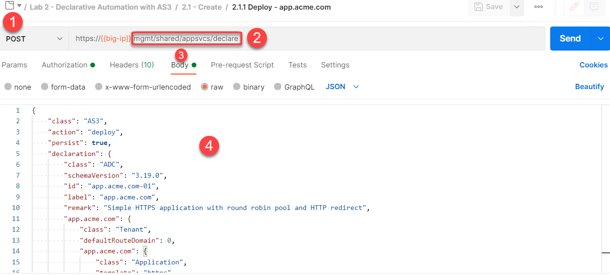
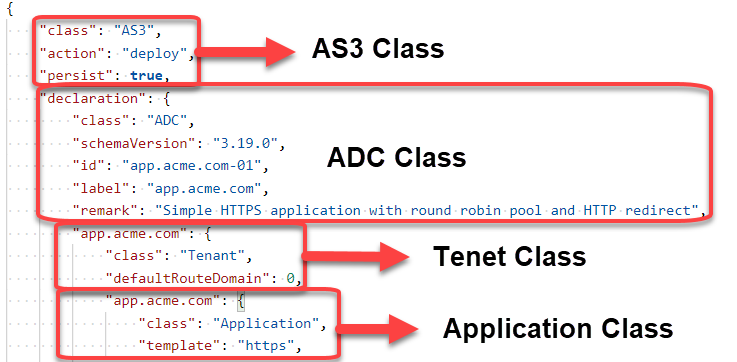
.. |class_2| image:: ./media/class_2.png
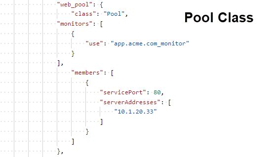
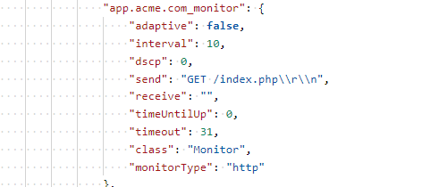

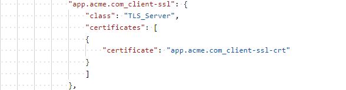

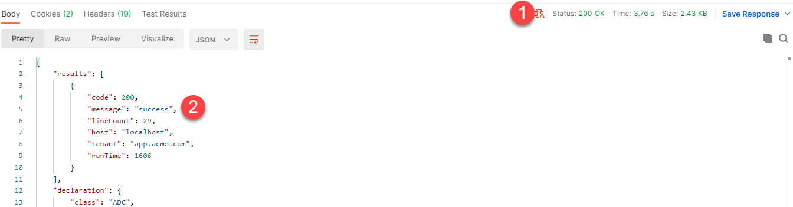
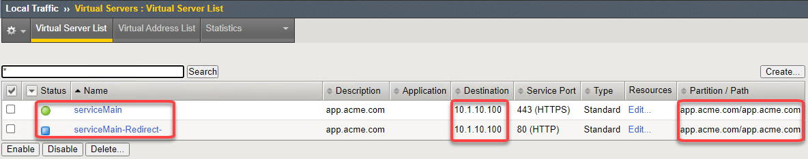
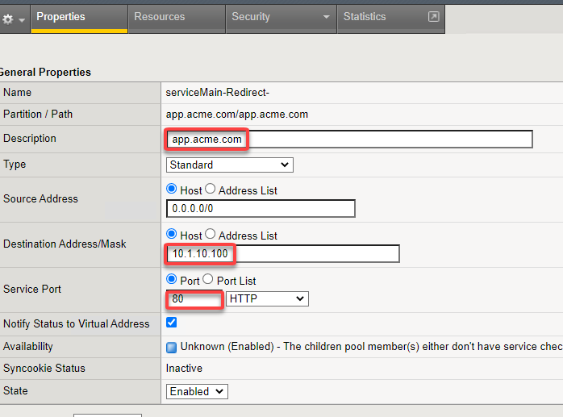
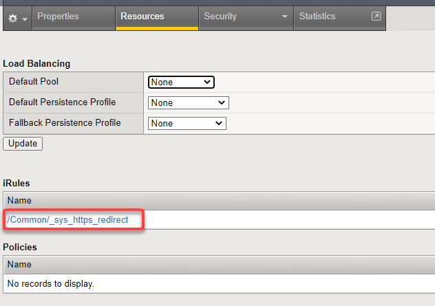
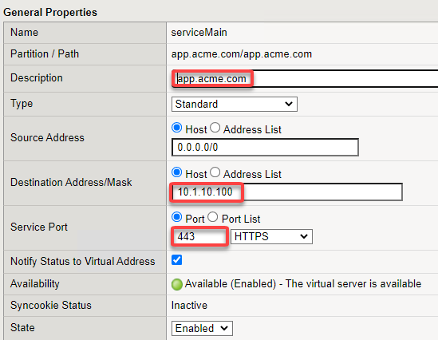
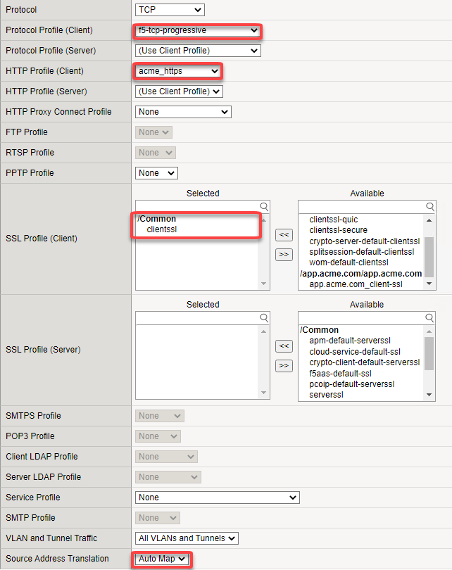
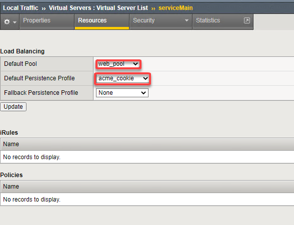
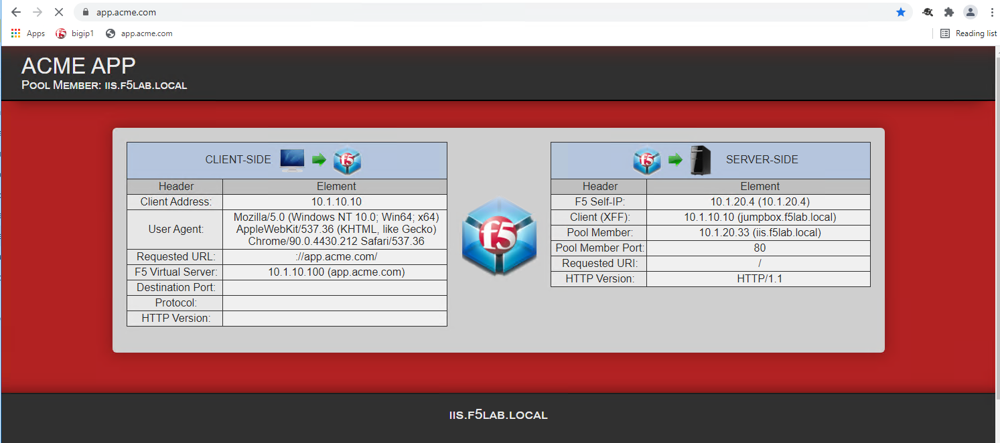
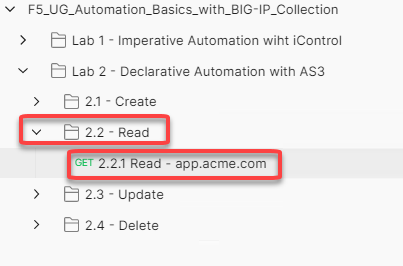
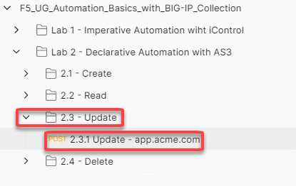
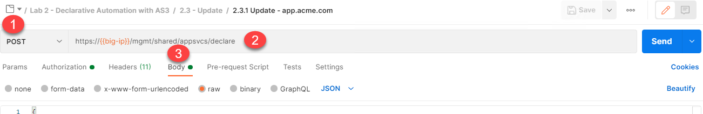
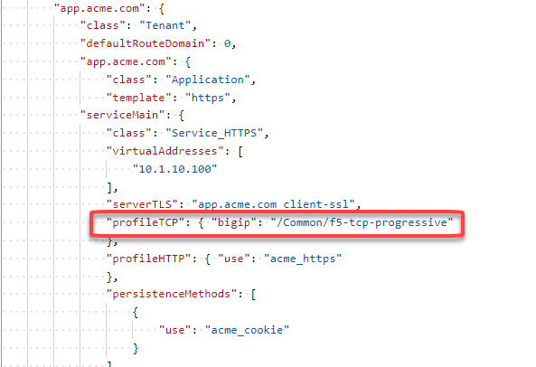
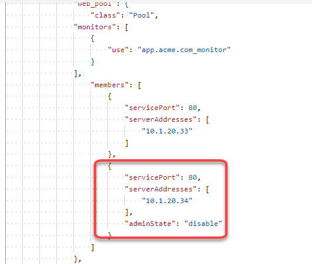
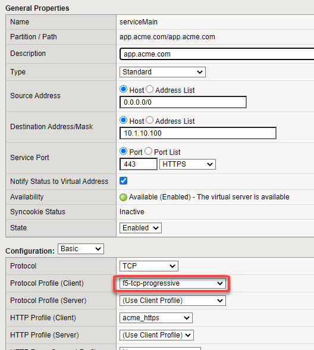
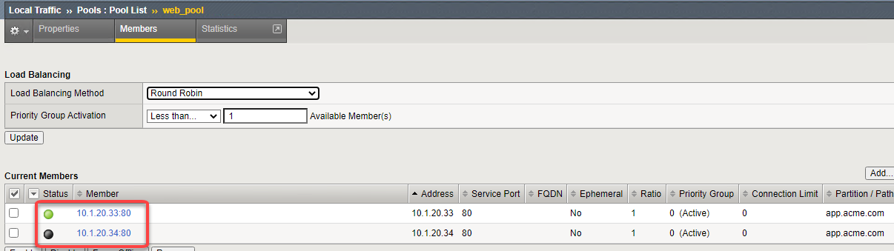
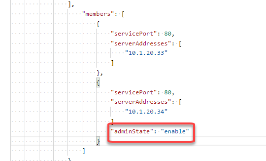
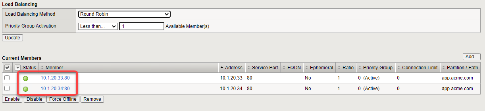
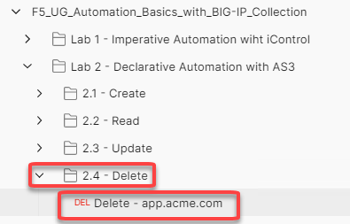
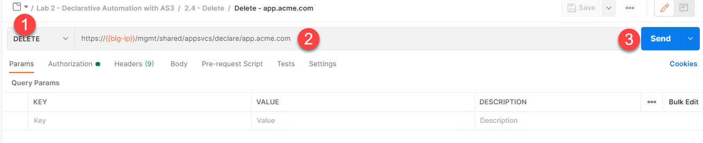
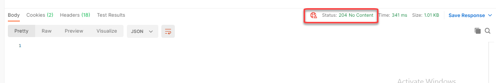
